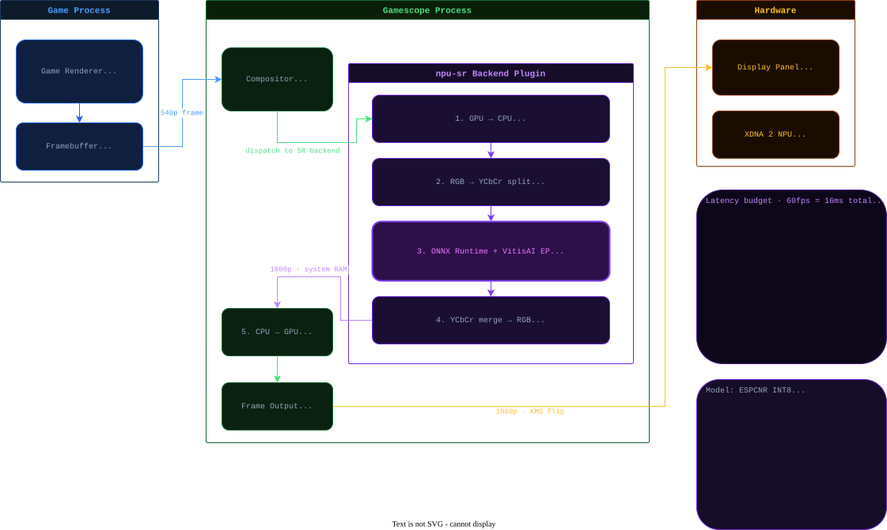

# npu-scope — NPU Super-Resolution for Linux
### End-to-end pipeline: capture → train → ONNX → inference → Gamescope

---

## What this is

An open-source Linux equivalent of Windows Auto SR, targeting the AMD XDNA 2 NPU
inside the ROG Xbox Ally X (and any Ryzen AI Z2 / Strix Point device). The model runs
as a Gamescope upscaling backend: the game renders at 540p, the NPU upscales to
1080p, the display sees 1080p — with zero GPU overhead.

**Hardware target:** ROG Xbox Ally X — AMD Ryzen AI Z2 Extreme, RDNA 3.5 iGPU (16 CUs),
XDNA 2 NPU (50 TOPS INT8), 1080p 120Hz screen.

Current status: training + inference pipeline. 





---

## Model architectures

Two architectures are available:

| Model | Params | Use case |
|---|---|---|
| `espcn` | ~24K | Baseline, original ESPCN (Shi et al., 2016) |
| `espcnr` | ~595K | Recommended — ESPCN with residual blocks, better edge quality |

Both operate on the **Y channel only** (YCbCr pipeline). Cb/Cr are bicubic-upscaled —
the eye is much less sensitive to chroma detail than luminance.

With the XDNA 2 NPU at 50 TOPS, models up to ~2M params are viable at 60fps.
`espcnr` at `d=64, num_blocks=8` (~595K params) is the current recommended target.

---

## Resolution strategy

| Stage | Resolution | Notes |
|---|---|---|
| Dataset (HR source) | **1440p native** | No upscaler active during capture |
| Generated LR (training) | **720p** | 2x bicubic downsample, on-the-fly |
| Inference — training machine | 720p → 1440p | Full quality test |
| Inference — ROG Xbox Ally X (target) | 540p → 1080p | Same 2x ratio |

Capture at native 1440p with **all upscalers disabled** (FSR, DLSS, XeSS, NIS,
Gamescope SR). The model learns from real pixel detail — upscaled source frames
undermine training quality.

---

## 0. Prerequisites

- Python 3.10 or newer
- An NVIDIA GPU (CUDA) or AMD GPU (ROCm) — CPU works but is slow
- `ffmpeg` installed (for video frame extraction and video upscaling)
- Git

---

## 1. Installation

### 1a. Clone the repo and create a virtual environment

```bash
git clone https://github.com/argeualcantara/linux-npu-scaler.git
cd linux-npu-scaler

python -m venv venv
source venv/bin/activate
```

### 1b. Install PyTorch

**NVIDIA GPU (CUDA 12.x):**
```bash
pip install torch torchvision --index-url https://download.pytorch.org/whl/cu121
```

**AMD GPU (ROCm):**
```bash
pip install torch torchvision --index-url https://download.pytorch.org/whl/rocm6.3
```

**CPU only (testing):**
```bash
pip install torch torchvision --index-url https://download.pytorch.org/whl/cpu
```

### 1c. Install remaining dependencies

```bash
pip install onnx onnxruntime-gpu numpy Pillow scipy
pip install mss          # optional: for live screen capture
```

### 1d. Fix ONNX CUDA library path (NVIDIA only)

If `onnxruntime-gpu` can't find CUDA libs, add the bundled nvidia libs to the path:

```bash
echo 'export LD_LIBRARY_PATH=$(find "$VIRTUAL_ENV/lib" -path "*/nvidia/*/lib" -type d | tr "\n" ":")$LD_LIBRARY_PATH' >> venv/bin/activate
```

Reactivate the venv after this change.

### 1e. Verify GPU detection

```bash
python -c "import torch; print('GPU:', torch.cuda.get_device_name(0) if torch.cuda.is_available() else 'not detected')"
```

---

## 2. Build the dataset (1440p HR images)

### Option A: Extract from a recorded video (recommended)

Record the game at **native 1440p** with OBS — no filters, no sharpening, no upscalers.

Checklist before recording:
- [ ] Game resolution: **2560×1440**
- [ ] FSR / DLSS / XeSS / NIS: **OFF**
- [ ] Gamescope upscaling: **OFF**
- [ ] In-game sharpening: **OFF**

```bash
python capture_dataset.py video \
  --source recording_1440p.mp4 \
  --output ./dataset \
  --every 30
```

### Option B: Live screen capture while playing

```bash
python capture_dataset.py screen \
  --output ./dataset \
  --duration 300 \
  --fps 2.0
```

**Minimum goal:** 1,000+ images. **Good goal:** 5,000+ from varied games and art styles.

---

## 3. Train the model

### Recommended: ESPCNR from scratch

```bash
python train.py \
  --data_dir ./dataset \
  --output model_espcnr.onnx \
  --model_type espcnr \
  --d 64 \
  --num_blocks 8 \
  --num_workers 8 \
  --epochs 150 \
  --batch_size 64 \
  --lr 0.0003 \
  --no_perceptual \
  --cache_images
```

### Fine-tune with perceptual + gradient loss (after base training)

```bash
python train.py \
  --data_dir ./dataset \
  --output model_espcnr_sharp.onnx \
  --model_type espcnr \
  --d 64 \
  --num_blocks 8 \
  --resume model_espcnr.pt \
  --epochs 20 \
  --lr 0.0001 \
  --no_amp \
  --cache_images
```

### Original ESPCN (lightweight baseline)

```bash
python train.py \
  --data_dir ./dataset \
  --output model.onnx \
  --epochs 100 \
  --batch_size 64 \
  --no_perceptual \
  --cache_images
```

### Training flags reference

| Flag | Default | Description |
|---|---|---|
| `--model_type` | `espcn` | Architecture: `espcn` or `espcnr` |
| `--d` | `56` | Feature channels (both models) |
| `--num_blocks` | `8` | Residual blocks (`espcnr` only) |
| `--data_dir` | `./dataset` | Folder with 1440p HR images |
| `--output` | `model.onnx` | ONNX export path |
| `--resume` | — | Checkpoint to resume from |
| `--epochs` | `50` | Number of training epochs |
| `--batch_size` | `32` | Patches per batch |
| `--lr` | `0.001` | Learning rate |
| `--no_perceptual` | off | Disable VGG16 perceptual loss (faster) |
| `--no_gradient` | off | Disable gradient edge loss |
| `--perceptual_weight` | `0.1` | Weight for perceptual loss term |
| `--gradient_weight` | `0.1` | Weight for gradient edge loss term |
| `--no_amp` | off | Disable mixed precision (use for perceptual fine-tune) |
| `--cache_images` | off | Pre-load entire dataset into RAM |
| `--cache_limit` | `0` | Cache up to N GB of images — rest loaded from disk (0 = no limit) |

### Inference flags reference (`upscale.py` and `upscale_vid.py`)

| Flag | Default | Description |
|---|---|---|
| `--sharpen` | off | Apply unsharp mask after SR (Y-channel only, no color saturation) |
| `--sharpen_radius` | `1.5` | Blur radius — smaller detects finer edges |
| `--sharpen_percent` | `150` | Strength — higher = more aggressive sharpening |
| `--sharpen_threshold` | `3` | Min pixel diff to sharpen — avoids amplifying noise |
| `--difference` | off | Save diff image: green = model sharper, red = model softer than bicubic |
| `--amplify` | `5.0` | Amplification factor for difference image visibility |

**Reading training output:**
```
Epoch 145 | Loss: 0.0070 | PSNR: 39.60 dB | SSIM: 0.9745
```
- **Loss** — combined loss (L1 + gradient + perceptual), lower is better
- **PSNR** — signal/noise ratio in dB; >35 dB is excellent for 2x SR
- **SSIM** — structural similarity 0→1; >0.95 is excellent

The final ONNX is exported from the **best checkpoint** (highest PSNR), not the last epoch.

---

## 4. Test with an image

```bash
# Basic upscale
python upscale.py --input test_540p.png --model model_espcnr.onnx

# Side-by-side comparison (model vs bicubic)
python upscale.py --input test_540p.png --model model_espcnr.onnx --compare

# Difference image (green = model sharper, red = model softer than bicubic)
python upscale.py --input test_540p.png --model model_espcnr.onnx --difference --amplify 5

# With post-processing sharpener (Y-channel unsharp mask)
python upscale.py --input test_540p.png --model model_espcnr.onnx --sharpen

# Force output resolution
python upscale.py --input test_540p.png --model model_espcnr.onnx --target_res 1920x1080
```

---

## 5. Upscale a video

```bash
python upscale_vid.py --input capture_540p.mp4 --model model_espcnr.onnx
python upscale_vid.py --input capture_540p.mp4 --model model_espcnr.onnx --sharpen
```

Uses ffmpeg pipes — no temp files. Frames travel as raw RGB24 bytes between ffmpeg
and Python. Expected throughput on GTX 1660 Ti: ~15 fps. Audio is preserved.

Output: `capture_540p_sr.mp4` in the same directory.

---

## 6. INT8 quantization for the XDNA 2 NPU (Phase 2)

Once happy with the FP32 ONNX model, quantize for NPU deployment.
INT8 is ~4x faster on the NPU's integer accelerators.

```bash
pip install quark

python -c "
from quark.onnx import ModelQuantizer
q = ModelQuantizer('model_espcnr.onnx', 'model_espcnr_int8.onnx')
q.quantize()
print('Done: model_espcnr_int8.onnx')
"
```

**Before quantizing:** verify VitisAI EP support for XDNA 2 / Z2 Extreme at
`ryzenai.docs.amd.com` — PixelShuffle operator support must be confirmed for this
NPU generation.

---

## 7. Gamescope integration (Phase 2)

Target architecture:

```
Game renders at 540p
    → Gamescope intercepts frame
    → [npu-scope backend] GPU→CPU copy
    → ONNX Runtime + VitisAI EP → XDNA 2 NPU (50 TOPS)
    → NPU outputs 1080p
    → CPU→GPU copy
    → Gamescope flips 1080p to display
```

Latency budget at 60fps (16ms total):
- GPU→CPU copy: ~1-2ms
- NPU inference INT8 (~595K params): ~2-4ms
- CPU→GPU copy: ~1-2ms
- Total overhead: ~4-8ms ✓

---

## References

- [ESPCN paper](https://arxiv.org/abs/1609.05158) — Real-Time Single Image and Video Super-Resolution (Shi et al., 2016)
- [AMD Ryzen AI docs](https://ryzenai.docs.amd.com)
- [AMD RyzenAI-SW](https://github.com/amd/RyzenAI-SW)
- [AMD XDNA driver](https://github.com/amd/xdna-driver)
- [ONNX Runtime docs](https://onnxruntime.ai/docs/)
- [Gamescope source](https://github.com/ValveSoftware/gamescope)
